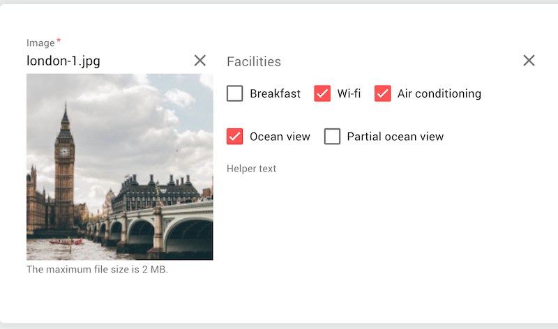

# Extensions for Vue Material



 * Server-side template creation [inline-template](https://vuejs.org/v2/guide/components-edge-cases.html#Inline-Templates)
 * Server-side localization
 * Single image field with dropzone support
 * Bitmask field
 * Built-in form validation (including server-side validation)
 * Built-in validation localization

## Dependencies

 * [vue-material](https://github.com/vuematerial/vue-material)
 * [vee-validate](https://github.com/logaretm/vee-validate)
 * [vue2-dropzone](https://github.com/rowanwins/vue-dropzone) included in production script

## Browser support

```JavaScript
"android": "81",
"chrome": "80",
"edge": "81",
"firefox": "77",
"ios": "13.5",
"opera": "67",
"safari": "13.1",
"samsung": "10.1"
```

## Install

 * npm install --save git+ssh://git@bitbucket.org/vitaliy_kovalenko/vue-md-form.git
 * Import locale to your project. Example for laravel-mix:

```JavaScript
mix.copyDirectory('node_modules/vee-validate/dist/locale', 'public/assets/locale');
mix.copy('node_modules/vue-md-form/dist/md-form.min.js', 'public/assets/js/md-form.min.js')
mix.copy('node_modules/vue-md-form/dist/md-form.css', 'public/assets/css/md-form.css')
```

<sup>Pre-built scripts and styles located in node_modules/vue-md-form/dist directory</sup>

## Example usage

```HTML
<link rel="stylesheet" href="//fonts.googleapis.com/css?family=Roboto:400,500,700,400italic|Material+Icons">
<link rel="stylesheet" href="https://unpkg.com/vue-material/dist/vue-material.min.css">
<link rel="stylesheet" href="https://unpkg.com/vue-material/dist/theme/default.css">
<link rel="stylesheet" href="/assets/css/md-form.css">

<script src="https://cdn.jsdelivr.net/npm/vue@2.6.11" defer></script>
<script src="https://unpkg.com/vue-material" defer></script>
<script src="https://unpkg.com/vee-validate@3.3.5/dist/vee-validate.full.min.js" defer></script>
```

```HTML
<div id="app">
	<md-form inline-template>
		<md-form-data ref="formData" action="/post/action/url" style="visibility: hidden;">
			<div class="md-layout md-gutter">
				<div class="md-layout-item md-size-20 md-small-size-30 md-xsmall-size-50">
					<validation-provider
						name="Image"
						rules="mimes:image/jpeg,image/png,image/gif|size:2000"
						v-slot="{ errors, validate }"
						slim bails>
					    <md-field class="img-field"
							:class="{ 'md-invalid': errors.length }"
							md-clearable>
					        <label>Image</label>
					        <md-image-dropzone
								v-model="room.image"
								:name="'app-model-room[image]'"
								accept="image/png,image/jpeg"
								max-size="2"
								@input="validate"
								required>
					        </md-image-dropzone>
					        <span class="md-helper-text">The maximum file size is 2 MB.</span>
					        <span class="md-error">{{ errors[0] }}</span>
					    </md-field>
					</validation-provider>
				</div>
				<div class="md-layout-item md-size-40 md-small-size-50 md-xsmall-size-100">
					<validation-provider
						name="Facilities"
						rules="integer"
						v-slot="{ errors, validate }"
						slim bails>
						<md-bitmask
							:name="'app-model-room[facilities]'"
							v-model="room.facilities"
							v-slot="{ values, disabled }"
							@input="validate"
							md-clearable>
							<label>Facilities</label>
							<div class="bitmask-checkboxes">
								<md-checkbox
									v-for="facility in $options.facilitiesAvailable"
									v-model="values"
									:key="facility.code"
									:value="facility.value"
									:disabled="disabled">{{facility.name}}</md-checkbox>
							</div>
							<div class="bitmask-messages">
								<span class="md-helper-text">Helper text</span>
								<span class="md-error">{{ errors[0] }}</span>
							</div>
						</md-bitmask>
					</validation-provider>
				</div>
			</div>
		</md-form-data>
	</md-md-form>
</div>

<script>
window.app = {
	data: {
		room: {
			image: null,
			facilities: 0
		}
	},
	options: {
		localeUrl: "/assets/form/locale",
		facilitiesAvailable: [
			{code: 'breakfast', name: 'Breakfast', value: 2},
			{code: 'wifi', name: 'Wi-fi', value: 4},
			{code: 'conditioning', name: 'Air conditioning', value: 8},
			{code: 'ocean', name: 'Ocean view', value: 16},
			{code: 'partialocean', name: 'Partial ocean view', value: 32}
		]
	}
}
</script>
```

### Without compiler

```HTML
<script src="/assets/js/md-form.min.js" defer></script>
```

Include form initialisation script aap.js

```javaScript
<script src="/js/aap.js" defer></script>
```

With content:

```javaScript
document.addEventListener("DOMContentLoaded", function() {
	Object.defineProperty(Vue.prototype, "$bus", {
		get: function() {
			return this.$root.bus;
		}
	});

	new Vue({
		el: '#app',
		components: {
			'md-form': MdForm
		},
		data: function () {
			return {
				bus: new Vue({})
			}
		}
	});
});
```

### With webpack

```JavaScript
// Component
import MdForm from 'vue-md-form'

export default {
	name: "MyForm",
	mixins: [MdForm],
	methods: {
		// Your application logic here
	}
}

// Entry point script
document.addEventListener("DOMContentLoaded", function() {
	Object.defineProperty(Vue.prototype,"$bus",{
		get: function() {
			return this.$root.bus;
		}
	});

	new Vue({
		el: '#app',
		components: {
			'md-form': MyForm
		},
		data: function () {
			return {
				bus: new Vue({})
			}
		}
	});
});
```

<sup>See example inside package</sup>


